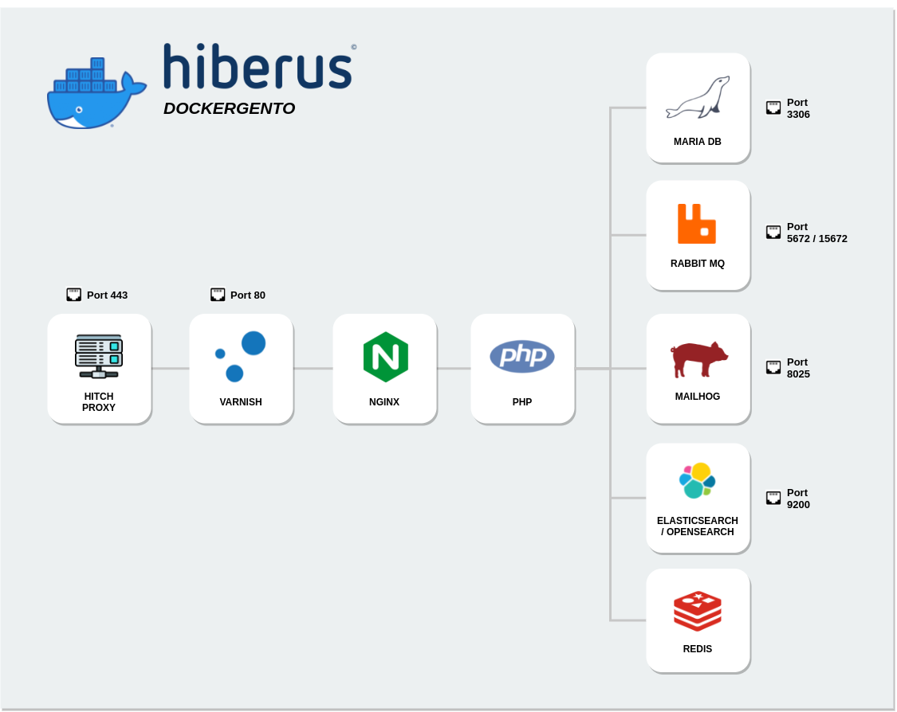

# Hiberus Dockergento

Docker environment for Magento 2 projects. Please visit our [Dockerhub repository](https://hub.docker.com/u/hiberusmagento).



## Docker images

- **Nginx**: `1.18`
- **PHP**: `7.2`, `7.3`, `7.4`, `8.1`, `8.2`
- **MariaDB**: `10.2`, `10.3`, `10.4`, `10.6`
- **RabbitMQ**: `3.9`
- **Redis**: `5.0`, `6.2`, `7.0`
- **ElasticSearch**: `5.6`, `6.5`, `7.17`
- **OpenSearch**: `1.2`, `2.5`
- **Mailhog**: `1.0`
- **Varnish**: `6.0`, `7.1`
- **Hitch**: `1.7`

<br>

## Magento compatible versions

- **Magento 2.4**: `2.4.0`, `2.4.1`, `2.4.2`, `2.4.3`, `2.4.4`, `2.4.5`, `2.4.6`.
- **Magento 2.3**: `2.3.0`, `2.3.1`, `2.3.2`, `2.3.3`, `2.3.4`, `2.3.5`, `2.3.6`, `2.3.7`.

_(All patched versions are also compatible)_

<br>

## Install Hiberus CLI
Hiberus CLI requires the next dependencies.
- [Homebrew](https://docs.brew.sh/Installation) (only Mac)
- [git](https://git-scm.com/downloads)
- [jq](https://stedolan.github.io/jq/download/)
- [oh-my-zsh](https://ohmyz.sh/) (recommended for Mac)

After installing these dependencies, launch the next command

```bash
curl https://raw.githubusercontent.com/hiberus-magento/hiberus-dockergento/main/installer.sh | bash
```

<br>

## Create environment
### Existing project
* You can execute the following command to create a Docker environment for an **existing project** (from the project directory).
```bash
cd <your_project>
hm setup
```
* If you want the docker config files to be outside your project not to be tracked by git.
```bash
cd wrapper_folder
hm setup
``` 
Answer this question with the relative path of your project.
<br>
<span style="color: steelblue;" >Magento root dir:  </span> <span style="color: #c0c0c0" ><your_project></span>

This will be the result
```
 ./wrapper_folder
    |__ config/
    |__ docker-compose.yml
    |__ docker-compose.dev.linux.yml
    |__ docker-compose.dev.mac.yml
    |__ <your_project>/
        |__ app/
        |__ ...
```
[setup command documentation](docs/setup.md)

---
### New project
You can launch following command to create a Docker environment for a **new project** (from a new empty directory).
```bash
hm create-project
```
<br>

[create-project command documentation](docs/create-project.md)


---

### Import database
You can launch the following command to import database and to save configs after import process.
```bash
hm mysql -i /path/.../dump.sql
```
<br>

[mysql command documentation](docs/mysql.md)

---

## Available commands

You can see all available commands by launching the following command.
```bash
hm --help
```
or specific command
```bash
hm setup --help
```

## Custom CLI Commands

- [bash](docs/bash.md)
- [cloud-login](docs/cloud-login.md)
- [cloud](docs/cloud.md)
- [compatibility](docs/compatibility.md)
- [composer](docs/composer.md)
- [config-env](docs/config-env.md)
- [copy-from-container](docs/copy-from-container.md)
- [copy-to-container](docs/copy-to-container.md)
- [create-project](docs/create-project.md)
- [debug-off](docs/debug-off.md)
- [debug-on](docs/debug-on.md)
- [docker-compose](docs/docker-compose.md)
- [docker-stop-all](docs/docker-stop-all.md)
- [down](docs/down.md)
- [exec](docs/exec.md)
- [grunt](docs/grunt.md)
- [install](docs/install.md)
- [magento](docs/magento.md)
- [mysql](docs/mysql.md)
- [mysqldump](docs/mysqldump.md)
- [n98-magerun](docs/n98-magerun.md)
- [npm](docs/npm.md)
- [purge](docs/purge.md)
- [rebuild](docs/rebuild.md)
- [restart](docs/restart.md)
- [set-host](docs/set-host.md)
- [setup](docs/setup.md)
- [ssl](docs/ssl.md)
- [start](docs/start.md)
- [stop](docs/stop.md)
- [test-integration](docs/test-integration.md)
- [test-unit](docs/test-unit.md)
- [transfer-db](docs/transfer-db.md)
- [transfer-media](docs/transfer-media.md)
- [update](docs/update.md)
- [varnish-off](docs/varnish-off.md)
- [varnish-on](docs/varnish-on.md)

<br>

## Thanks to

* This project is based on [Dockergento](https://github.com/ModestCoders/magento2-dockergento). Special thanks to **ModestCoders** for their work.
* Several improvements have been inspired on [Docker-magento](https://github.com/markshust/docker-magento).

<br>

## Copyright

[(c) Hiberus Tecnología](https://hiberus.com).

<br/>

## License

[GNU General Public License, version 3 (GPLv3)](https://opensource.org/licenses/gpl-3.0).
