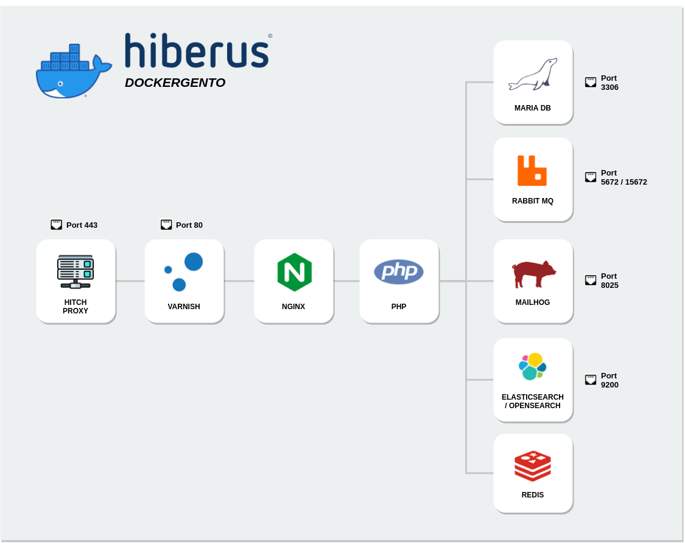

# Hiberus Dockergento

Docker environment for Magento 2 projects. Please visit our [Dockerhub repository](https://hub.docker.com/u/hiberusmagento).

[](https://opensource.org/licenses/gpl-3.0)
[](https://hub.docker.com/u/hiberusmagento)
[](https://experienceleague.adobe.com/docs/commerce-operations/release/notes/overview.html)



## Docker images

- **Nginx**: `1.18`
- **PHP**: `7.2`, `7.3`, `7.4`, `8.1`, `8.2`, `8.3`, `8.4`
- **MariaDB**: `10.2`, `10.3`, `10.4`, `10.6`, `11.4`
- **RabbitMQ**: `3.9`
- **Redis**: `5.0`, `6.2`, `7.0`
- **ElasticSearch**: `5.6`, `6.5`, `7.17`
- **OpenSearch**: `1.2`, `2.5`
- **Mailhog**: `1.0`
- **Varnish**: `6.0`, `7.1`
- **Hitch**: `1.7`

> MariaDB `11.4` uses the official `mariadb:11.4` image directly (no Hiberus wrapper).

<br>

## Magento compatible versions

- **Magento 2.4**: `2.4.0`, `2.4.1`, `2.4.2`, `2.4.3`, `2.4.4`, `2.4.5`, `2.4.6`, `2.4.7`, `2.4.8`.
- **Magento 2.3**: `2.3.0`, `2.3.1`, `2.3.2`, `2.3.3`, `2.3.4`, `2.3.5`, `2.3.6`, `2.3.7`.

_(All patched versions are also compatible — run `hm compatibility` to see the full list)_

<br>

## Install Hiberus CLI
Hiberus CLI requires the next dependencies.
- [Homebrew](https://docs.brew.sh/Installation) (only Mac)
- [git](https://git-scm.com/downloads)
- [jq](https://stedolan.github.io/jq/download/)
- [oh-my-zsh](https://ohmyz.sh/) (recommended for Mac)

After installing these dependencies, launch the next command

```bash
curl https://raw.githubusercontent.com/hiberus-magento/hiberus-dockergento/main/installer.sh | bash
```

<br>

## Create environment

### Existing project

Run the following command from your project directory to create a Docker environment for an **existing project**.

```bash
cd <your_project>
hm setup
```

If you want the docker config files to be outside your project (not tracked by git):

```bash
cd wrapper_folder
hm setup
```

Answer this question with the relative path of your project.

<br>
<span style="color: steelblue;" >Magento root dir:  </span> <span style="color: #c0c0c0" ><your_project></span>

This will be the result

```
 ./wrapper_folder
    |__ config/
    |__ docker-compose.yml
    |__ docker-compose.dev.linux.yml
    |__ docker-compose.dev.mac.yml
    |__ <your_project>/
        |__ app/
        |__ ...
```

[setup command documentation](docs/setup.md)

---

### New project

Run the following command from a new empty directory to create a Docker environment for a **new project**.

```bash
hm create-project
```

<br>

[create-project command documentation](docs/create-project.md)

---

### Import database

```bash
hm mysql -i /path/.../dump.sql
```

<br>

[mysql command documentation](docs/mysql.md)

---

## Available commands

```bash
hm --help          # list all available commands
hm setup --help    # help for a specific command
```

## Custom CLI Commands

| Command | Description |
|---|---|
| [bash](docs/bash.md) | Open a bash session inside the PHP container |
| [cloud-login](docs/cloud-login.md) | Authenticate with Adobe Commerce Cloud |
| [cloud](docs/cloud.md) | Run Adobe Commerce Cloud CLI commands |
| [compatibility](docs/compatibility.md) | Show Magento version compatibility table |
| [composer](docs/composer.md) | Run Composer inside the PHP container |
| [config-env](docs/config-env.md) | Generate `env.php` from environment variables |
| [copy-from-container](docs/copy-from-container.md) | Copy files from a container to the host |
| [copy-to-container](docs/copy-to-container.md) | Copy files from the host to a container |
| [create-project](docs/create-project.md) | Create a new Magento project |
| [debug-off](docs/debug-off.md) | Disable Xdebug |
| [debug-on](docs/debug-on.md) | Enable Xdebug |
| [docker-compose](docs/docker-compose.md) | Proxy for `docker compose` with project config |
| [docker-stop-all](docs/docker-stop-all.md) | Stop all running Docker containers |
| [down](docs/down.md) | Stop and remove containers |
| [exec](docs/exec.md) | Execute a command in a running container |
| [grunt](docs/grunt.md) | Run Grunt inside the PHP container |
| [install](docs/install.md) | Install Magento |
| [magento](docs/magento.md) | Run Magento CLI commands |
| [masquerade](docs/masquerade.md) | Generate customer tokens for testing |
| [mysql](docs/mysql.md) | Access MySQL / import a dump |
| [mysqldump](docs/mysqldump.md) | Export a database dump |
| [n98-magerun](docs/n98-magerun.md) | Run n98-magerun2 commands |
| [npm](docs/npm.md) | Run npm inside the PHP container |
| [purge](docs/purge.md) | Remove all containers, volumes and images |
| [rebuild](docs/rebuild.md) | Rebuild Docker images |
| [restart](docs/restart.md) | Restart containers |
| [set-host](docs/set-host.md) | Add a hostname entry to `/etc/hosts` |
| [setup](docs/setup.md) | Generate Docker environment for a project |
| [ssl](docs/ssl.md) | Generate a self-signed SSL certificate |
| [start](docs/start.md) | Start containers |
| [stop](docs/stop.md) | Stop containers |
| [test-integration](docs/test-integration.md) | Run Magento integration tests |
| [test-unit](docs/test-unit.md) | Run Magento unit tests |
| [transfer-db](docs/transfer-db.md) | Transfer a database between environments |
| [transfer-media](docs/transfer-media.md) | Transfer media files between environments |
| [update](docs/update.md) | Update Hiberus CLI to the latest version |
| [varnish-off](docs/varnish-off.md) | Disable Varnish |
| [varnish-on](docs/varnish-on.md) | Enable Varnish |

<br>

## Related Projects

### Hiberus Magento AI Tools

[hiberus-magento/ai-tools](https://github.com/hiberus-magento/ai-tools) — AI-powered skills and agents for Magento 2 that extend AI coding assistants (Claude, Copilot, Cursor, Gemini, etc.) with expert Magento knowledge. Dockergento integrates with ai-tools to provide an agile, AI-assisted development workflow.

<br>

## Thanks to

* This project is based on [Dockergento](https://github.com/ModestCoders/magento2-dockergento). Special thanks to **ModestCoders** for their work.
* Several improvements have been inspired on [Docker-magento](https://github.com/markshust/docker-magento).

<br>

## Copyright

[(c) Hiberus Tecnología](https://hiberus.com).

<br/>

## License

[GNU General Public License, version 3 (GPLv3)](https://opensource.org/licenses/gpl-3.0).
