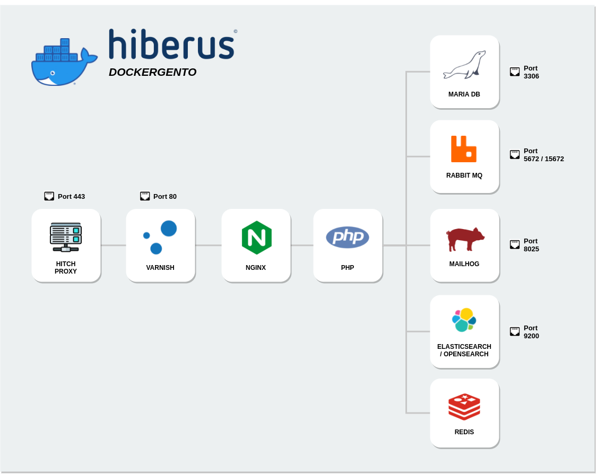

# Hiberus Dockergento

Docker environment for Magento 2 projects. Please visit our [Dockerhub repository](https://hub.docker.com/u/hiberusmagento).

[](https://opensource.org/licenses/gpl-3.0)
[](https://hub.docker.com/u/hiberusmagento)
[](https://experienceleague.adobe.com/docs/commerce-operations/release/notes/overview.html)



## Docker images

- **Nginx**: `1.18`, `1.28`, `1.30`
- **PHP**: `7.2`, `7.3`, `7.4`, `8.1`, `8.2`, `8.3`, `8.4`, `8.5`
- **MariaDB**: `10.2`, `10.3`, `10.4`, `10.6`, `11.4`, `11.8`, `12.3`
- **RabbitMQ**: `3.9`, `4.2`, `4.3`
- **Redis**: `5.0`, `6.2`, `7.0`
- **Valkey**: `9`
- **ElasticSearch**: `5.6`, `6.5`, `7.17`
- **OpenSearch**: `1.2`, `2.5`, `3`
- **Mailhog**: `1.0`
- **Varnish**: `6.0`, `7.1`
- **Hitch**: `1.7`

> MariaDB `11.4` / `11.8` / `12.3` use the official `mariadb:11.4` / `mariadb:11.8` / `mariadb:12.3` images directly (no Hiberus wrapper).
> Valkey `9` uses the official `valkey/valkey:9-alpine` image directly (no Hiberus wrapper). It is a drop-in replacement for Redis and is wired through the same `redis` service slot, so no Magento configuration changes are required.

<br>

## Magento compatible versions

- **Magento 2.4**: `2.4.0`, `2.4.1`, `2.4.2`, `2.4.3`, `2.4.4`, `2.4.5`, `2.4.6`, `2.4.7`, `2.4.8`, `2.4.9`.
- **Magento 2.3**: `2.3.0`, `2.3.1`, `2.3.2`, `2.3.3`, `2.3.4`, `2.3.5`, `2.3.6`, `2.3.7`.

_(All patched versions are also compatible — run `hm compatibility` to see the full list)_

<br>

## Install Hiberus CLI
Hiberus CLI requires the next dependencies.
- [Homebrew](https://docs.brew.sh/Installation) (only Mac)
- [git](https://git-scm.com/downloads)
- [jq](https://stedolan.github.io/jq/download/)
- [oh-my-zsh](https://ohmyz.sh/) (recommended for Mac)

After installing these dependencies, launch the next command

```bash
curl https://raw.githubusercontent.com/hiberus-magento/hiberus-dockergento/main/installer.sh | bash
```

<br>

## Create environment

### Existing project

Run the following command from your project directory to create a Docker environment for an **existing project**.

```bash
cd <your_project>
hm setup
```

If you want the docker config files to be outside your project (not tracked by git):

```bash
cd wrapper_folder
hm setup
```

Answer this question with the relative path of your project.

<br>
<span style="color: steelblue;" >Magento root dir:  </span> <span style="color: #c0c0c0" ><your_project></span>

This will be the result

```
 ./wrapper_folder
    |__ config/
    |__ docker-compose.yml
    |__ docker-compose.dev.linux.yml
    |__ docker-compose.dev.mac.yml
    |__ <your_project>/
        |__ app/
        |__ ...
```

[setup command documentation](docs/setup.md)

---

### New project

Run the following command from a new empty directory to create a Docker environment for a **new project**.

```bash
hm create-project
```

<br>

[create-project command documentation](docs/create-project.md)

---

### Import database

```bash
hm mysql -i /path/.../dump.sql
```

<br>

[mysql command documentation](docs/mysql.md)

---

## Available commands

Run `hm --help` for the full list, grouped by purpose, with examples:

```
█  █ █▀▄▀█   Hiberus Dockergento
█▀▀█ █ ▀ █   Docker environments for Magento 2
▀  ▀ ▀   ▀

Usage: hm <command> [options]

Environment
  start                 Start docker services
  doctor                Diagnose the machine and the current project
  describe              Show everything that defines the current project
  ...

Examples
  hm start                      Bring the environment up
  hm magento cache:clean        Run a Magento command
  hm mysql -i dump.sql          Import a database dump
```

A new command joins a group by declaring `"group"` in `data/command_descriptions.json`;
one without a group shows up under `Other`.

## Available commands (detail)

```bash
hm --help          # list all available commands
hm setup --help    # help for a specific command
```

## Output, exit codes and non-interactive use

Every command can be consumed by a person or by a machine (a script, a CI job, an AI
agent). The rules are the same everywhere:

**Output format.** Informational commands print readable text when their output goes to a
terminal, and JSON when it is piped or redirected. Force either one with `--json` or
`--no-json`.

```bash
hm describe              # readable text in a terminal
hm describe | jq .       # JSON, because stdout is not a terminal
hm describe --json       # JSON on demand
```

Commands whose output *is* data are never wrapped: `mysqldump`, `mysql`, `logs`,
`copy-from-container` and the passthrough commands (`exec`, `bash`, `magento`,
`composer`, `npm`, `n98-magerun`, `grunt`, `test-*`, `cloud`) always emit exactly what
they produce.

**Errors** go to stderr in both formats, so `hm <command> > file` never captures a
failure as if it were output. In JSON mode an error looks like:

```json
{ "schema_version": 1, "command": "start", "ok": false,
  "error": { "code": 3, "type": "docker_unavailable",
             "message": "Docker is not running",
             "hint": "Start Docker and try again" } }
```

**Exit codes:**

| Code | Meaning |
|------|---------|
| `0`  | Success |
| `1`  | Generic error |
| `2`  | Invalid arguments or unknown command |
| `3`  | Docker daemon unavailable |
| `4`  | Not a configured Dockergento project |
| `5`  | A required service is not running |
| `6`  | Refused from a git worktree ([details](docs/worktree.md)) |

**Colour.** Colour marks state (error, warning, success) and highlights what you can act
on; everything else stays in your terminal's own colour. The decision follows the usual
ecosystem standards, in this order of precedence:

| | Effect |
|---|---|
| `--no-color` | Never colour, whatever else is set |
| `NO_COLOR` (set and non-empty) | Never colour — the [no-color.org](https://no-color.org/) standard |
| `TERM=dumb` or empty | Never colour |
| `FORCE_COLOR` / `CLICOLOR_FORCE` | Colour even when the output is piped, for CI logs that render ANSI |
| stdout is not a terminal | No colour |

The text is identical either way: removing the colour never removes information.

**Non-interactive mode.** With `--yes` or `HM_NON_INTERACTIVE=1` no command waits for
input: questions with a default answer use it, and a question that cannot be guessed
fails with exit code `2` and a message naming the option to pass instead.

```bash
HM_NON_INTERACTIVE=1 hm setup -p myproject -d myproject.local -r .
```

<br>

## Custom CLI Commands

| Command | Description |
|---|---|
| [bash](docs/bash.md) | Open a bash session inside the PHP container |
| [cloud-login](docs/cloud-login.md) | Authenticate with Adobe Commerce Cloud |
| [cloud](docs/cloud.md) | Run Adobe Commerce Cloud CLI commands |
| [compatibility](docs/compatibility.md) | Show Magento version compatibility table |
| [composer](docs/composer.md) | Run Composer inside the PHP container |
| [config-env](docs/config-env.md) | Generate `env.php` from environment variables |
| [copy-from-container](docs/copy-from-container.md) | Copy files from a container to the host |
| [copy-to-container](docs/copy-to-container.md) | Copy files from the host to a container |
| [create-project](docs/create-project.md) | Create a new Magento project |
| [debug-off](docs/debug-off.md) | Disable Xdebug |
| [debug-on](docs/debug-on.md) | Enable Xdebug |
| [docker-compose](docs/docker-compose.md) | Proxy for `docker compose` with project config |
| [docker-stop-all](docs/docker-stop-all.md) | Stop all running Docker containers |
| [down](docs/down.md) | Stop and remove containers |
| [exec](docs/exec.md) | Execute a command in a running container |
| [grunt](docs/grunt.md) | Run Grunt inside the PHP container |
| [install](docs/install.md) | Install Magento |
| [magento](docs/magento.md) | Run Magento CLI commands |
| [masquerade](docs/masquerade.md) | Generate customer tokens for testing |
| [mysql](docs/mysql.md) | Access MySQL / import a dump |
| [mysqldump](docs/mysqldump.md) | Export a database dump |
| [n98-magerun](docs/n98-magerun.md) | Run n98-magerun2 commands |
| [npm](docs/npm.md) | Run npm inside the PHP container |
| [purge](docs/purge.md) | Remove all containers, volumes and images |
| [rebuild](docs/rebuild.md) | Rebuild Docker images |
| [restart](docs/restart.md) | Restart containers |
| [set-host](docs/set-host.md) | Add a hostname entry to `/etc/hosts` |
| [setup](docs/setup.md) | Generate Docker environment for a project |
| [ssl](docs/ssl.md) | Generate a self-signed SSL certificate |
| [start](docs/start.md) | Start containers |
| [stop](docs/stop.md) | Stop containers |
| [test-integration](docs/test-integration.md) | Run Magento integration tests |
| [test-unit](docs/test-unit.md) | Run Magento unit tests |
| [transfer-db](docs/transfer-db.md) | Transfer a database between environments |
| [transfer-media](docs/transfer-media.md) | Transfer media files between environments |
| [update](docs/update.md) | Update Hiberus CLI to the latest version |
| [varnish-off](docs/varnish-off.md) | Disable Varnish |
| [varnish-on](docs/varnish-on.md) | Enable Varnish |

<br>

## Related Projects

### Hiberus Magento AI Tools

[hiberus-magento/ai-tools](https://github.com/hiberus-magento/ai-tools) — AI-powered skills and agents for Magento 2 that extend AI coding assistants (Claude, Copilot, Cursor, Gemini, etc.) with expert Magento knowledge. Dockergento integrates with ai-tools to provide an agile, AI-assisted development workflow.

<br>

## Thanks to

* This project is based on [Dockergento](https://github.com/ModestCoders/magento2-dockergento). Special thanks to **ModestCoders** for their work.
* Several improvements have been inspired on [Docker-magento](https://github.com/markshust/docker-magento).

<br>

## Copyright

[(c) Hiberus Tecnología](https://hiberus.com).

<br/>

## License

[GNU General Public License, version 3 (GPLv3)](https://opensource.org/licenses/gpl-3.0).
